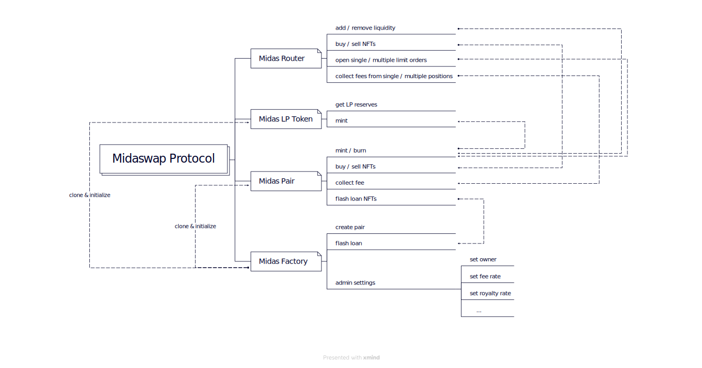

# midaswap-protocol-1.2

This repository contains the Midas721 contracts.

- The [MidasPair721](./MidasPair721.sol) is the contract that contains all the logic of the actual pair for swaps, adds, removals of liquidity and fee claiming. This contract should never be deployed directly, and the factory should always be used for that matter.

- The [LPToken](./LPToken.sol) is simplified version of ERC-721 which wraps the positons of liquidity.

- The [MidasFactory721](./MidasFactory721.sol) is the contract used to deploy the different pairs and acts as a registry for all the pairs already created. There are also privileged functions such as setting the parameters of the fees, royalty fees, setting the pair implementation. Unless the `createPairLock` is `false`, only the owner of the factory can create pairs.

- The [MidasRouter](./MidasRouter.sol) is the main contract that user will interact with as it adds security checks. Most users shouldn't interact directly with the pair.

